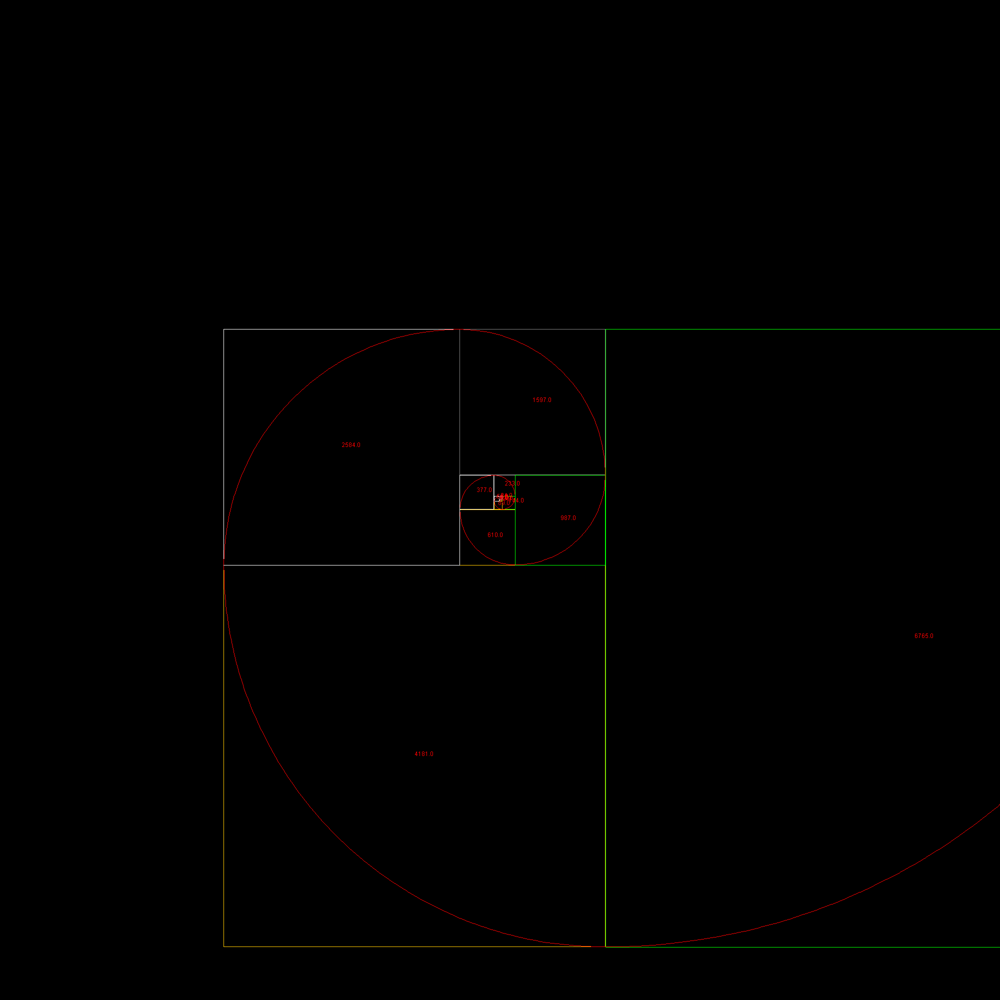

# Software-Engineering-Spring-2024
Project for a Software Engineering course at SUNY New Paltz
By: Nathan Gopee, CJ Jenks, and Mike Manzi

## Table of Contents
- [Project Description](#project-description)
- [System Diagram](#system-diagram)
- [Example Input](#example-input)
- [Example Output](#example-output)
- [Prototype Code](#prototype-code)

## Project Description
This project is a web application that will generate a fractal image based on the Fibonacci sequence. The user will input a number, and the application will generate a fractal construction data and raw image based on the Fibonacci sequence up to that number. Clientside, the application will allow for scaling and panning of the Fibonacci fractal.

## Example Fractal Spiral(from prototype code)


## System Diagram


## Example Input
```javascript
// Input is always primed with a json object discussing payload and output types and data
// Output is always a json object with the payload data and output data

// Example inputs:
{
  inputType: 'json', //  'csv', json, file, database, ...
  delimiter: ';', // if applicable. ignored if not
  payloadData: "{maxElement: 20}", // is a path to a file, a json object, a csv string, a database connection, ...
  outputType: 'payload', // 'csv', payload, file, database, ...
  outputData: "" // is a path to a file, a json object, a csv string, a database connection, ...
}

{
  inputType: 'csv', //  'csv', json, file, database, ...
  delimiter: ';', // if applicable. ignored if not
  payloadData: "20", // is a path to a file, a json object, a csv string, a database connection, ...
  outputType: 'csv', // 'csv', payload, file, database, ...
  outputData: "" // is a path to a file, a json object, a csv string, a database connection, ...
}
```
## Example Output
```javascript
// Example outputs:
{
  outputType: "json", // type of payload data
  payloadData: {
    maxElement: 20,
    fibSequence:  [1, 1, 2, 3, 5, 8, ...], // fib sequence
    rectSequence: [[0,0], [0,1], [-1,-2], ...], // fractal rectangle offsets
    pngBase64:    "base64encodedstring", // image of fractal
  }
}
{
  outputType: "csv", // type of payload data
  payloadData: "1,1,2,3,5,8,...;[0,0], [0,1], [-1,-2],...;base64encodedstring", // csv string
}
```

## Prototype Code
[Click to view](/src/main/java/org/legacy/) Written without full api implementation. This is a quick and dirty demonstration of what the code should look like.


# Benchmark Testing and Optimization

## Optimization
1. **Initial Issues:**
   - Inefficient memory allocation caused memory exhaustion and prolonged execution times exceeding 20+ minutes.
  
2. **Memory Optimization with HashMap:**
   - Implemented a caching mechanism using a HashMap to optimize the computation algorithm.
   - Stored previously calculated Fibonacci values in the HashMap for reuse, reducing the memory footprint and improving efficiency.
  
3. **Impact of Optimization:**
   - Memory usage became more efficient, preventing memory exhaustion issues post-optimization.
   - Computation time was drastically reduced, ensuring computations were completed within a reasonable timeframe.
  
4. **Benchmark Results:**
   - Reran integration tests to evaluate performance improvements.
   - Optimized compute engine showcased significantly faster execution times and stable memory usage compared to the initial implementation.
   - Integration tests validated that requests were processed within an acceptable duration, meeting performance requirements.

## Benchmark Results

### Before


### After


# Restrospective
## Issue
The Vue.js application is not implemented with gRPC  
### Why? The Vue.js application is currently using HTTP requests (axios) to communicate with the server. 
The Vue.js application is using axios, a promise-based HTTP client, to send HTTP requests to the server. This is evident in the startComputeJob, pollJobStatus, and fetchJobResults methods in the App.vue file. While HTTP/axios is a common choice for client-server communication in web applications, it does not utilize the benefits of gRPC such as efficient binary serialization, HTTP/2 protocol advantages, and full-duplex streaming.
### Why? We weren’t familiar with gRPC or how to use it in a Vue.js application.  
Implementing gRPC in a Vue.js application requires knowledge of gRPC concepts, protobufs, and how to set up a gRPC client in JavaScript. We maybe just are unexperienced with gRPC usage in JavaScript.
### Why? The project requirements did not necessitate the use of gRPC.  
The decision to use gRPC or HTTP could be influenced by various project requirements or constraints such as the need for real-time communication, the complexity of the data structures being transmitted, the need for low latency, and the supported technologies of the server and client platforms. The requirements or constraints did not necessitate the use of gRPC, and to be honest HTTP/axios was better at the moment for its simplicity and ease of use.
### Why? The existing server-side implementation might not support gRPC.  
The server-side implementation needs to support gRPC for the Vue.js application to use it. If the server-side implementation is using technologies that do not support gRPC or if it is not set up to handle gRPC requests, we would not be able to use gRPC in the Vue.js application. In this case, the server-side implementation is using Java and gRPC, so this is not a limiting factor.
### Why? The benefits of using gRPC may not outweigh the time of implementing it.  
In-depth explanation: Mike was tired really didn’t want too. Implementing gRPC in the Vue.js application would require significant changes to the codebase and could introduce new complexities and challenges. Mike would need to weigh the benefits of using gRPC, such as improved performance and efficiency, against these costs. If the benefits do not outweigh the costs, it would be rational to continue using HTTP/axios.
## Actionable Change
To address this issue, we could learn about gRPC and how to use it in a Vue.js application. They could then refactor the startComputeJob, pollJobStatus, and fetchJobResults methods to use a gRPC client instead of axios. This would also involve updating the server-side implementation to handle the gRPC requests from the Vue.js application. But we should also consider the project requirements and constraints and evaluate whether the benefits of using gRPC outweigh the time it would take.


